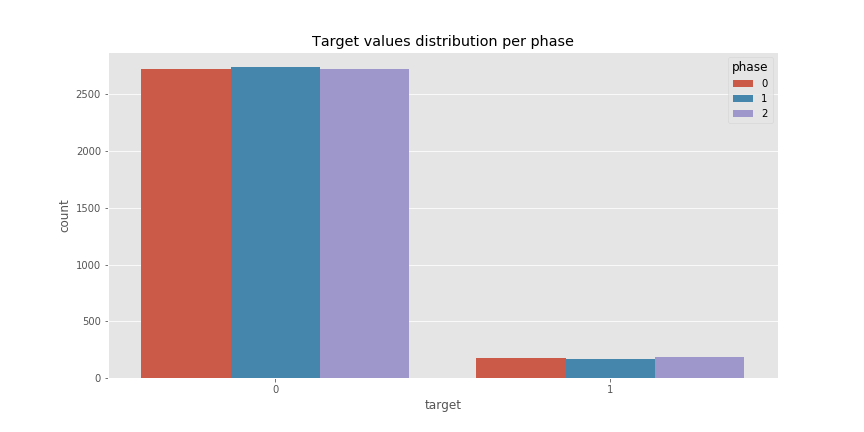
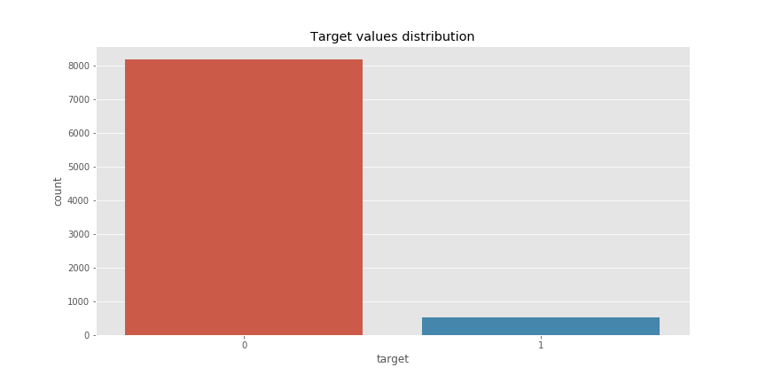
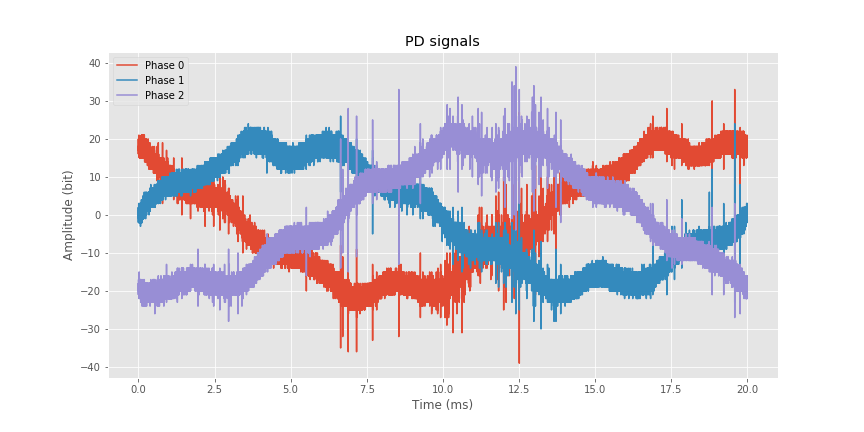

# Machine Learning Engineer Nanodegree
## Capstone Project
Victor São Paulo Ruela

February 5th, 2019

## I. Definition

### Project Overview

Partial Discharge (PD) signals are electrical discharges that can occur inside the insulation of high voltage equipments. These signals have a repetitive nature and are confined to small regions, which in the long run can lead to irreparable damage to the equipment. Therefore, it is vital for the energy industry companies to monitor the occcurrance of PDs, in order to prevent accidents and guarantee a realiable energy transmission for its customers.

Measuring these signals in the field is already very challenging task, due to its low intensity and high noise levels from high voltage systems. However, this is just one part of the problem: based on the measurements, how can we predict some of its characteristics, such as faults, the level of damage, local of occurrence and possible causes? These are tasks that can be achieve with signal processing techniques and machine learning algorithms.

The dataset that is going to be used is available from the VSB Power Line Fault Detection Kaggle competition website:

https://www.kaggle.com/c/vsb-power-line-fault-detection

It contains several examples of labeled PD signals (fault or undamaged). Each signal contains 800,000 measurements of a power line's voltage, taken over 20 milliseconds for each one of the three phases.

### Problem Statement

The goal is to train a classification algorithm to predict for PD signal measurements if a power line damaged or not. I will be tackling this problem as a binary classification problem, also applying digital signal processing techniques to extract the most relevant features from the PD signals.

The first task will be to apply signal processing techniques in order to remove the background noise from the measurements and obtain a clear representation of the partial discharge signals. This can be done using digital filters (Butterworth, Chebyschev, etc.), the Fourier Transform and the Discrete Wavelet Transform (DWT). After that, new features will be extracted, such as amount of PDs and the frequency-domain content. If necessary, more features can be include based on the thesis from the competition's responsible [1]:

http://dspace.vsb.cz/bitstream/handle/10084/133114/VAN431_FEI_P1807_1801V001_2018.pdf

For the training models, I pretend to compare binary classification models, such as Logistic Regression and Random Forests. I will work with simpler models in order to have more time available for the feature extraction, since this should be the most important taks on this porject. I expect to spend 70% of the time on the signal processing and feature extraction parts and 30% of the time on training models and tweaking parameters.

### Metrics

The results will be evaluated with the [Matthews correlation coefficient (MCC)](https://en.wikipedia.org/wiki/Matthews_correlation_coefficient) between the predicted and the observed response:

where TP is the number of true positives, TN the number of true negatives, FP the number of false positives, and FN the number of false negatives. This is a very suitable metric, since the dataset is probably unbalanced because faults are not very frequent. 

This is the same metric used in the competition.

## II. Analysis
_(approx. 2-4 pages)_

### Data Exploration and Visualization

The dataset is available at https://www.kaggle.com/c/vsb-power-line-fault-detection/data

It contains the following files:

a) metadata_[train/test].csv - The signal general information and labels. Contatins the following columns:

* `id_measurement`: the ID code for a trio of signals recorded at the same time.

* `signal_id`: the foreign key for the signal data. Each signal ID is unique across both train and test, so the first ID in train is '0' but the first ID in test is '8712'.

* `phase`: the phase ID code within the signal trio. The phases may or may not all be 
impacted by a fault on the line.

* `target`: 0 if the power line is undamaged, 1 if there is a fault.

b) [train/test].parquet - The signal data. Each column contains one signal; 800,000 int8 measurements as exported with pyarrow.parquet version 0.11. More information about the parquet format can be found in https://acadgild.com/blog/parquet-file-format-hadoop.

The metadata file is link between the actual PD signals measurements in the parquet file and its label. For example, to access the signal with ID "1", you just need to load the column "1" from the .parquet file. This is actually a very interesting feature, because it allows to optimize the memory consumption by processing one signal at a time.

The `metadata_train.csv` file contains `8712` rows, each one representing a signal available in the `train.parquet` file. The overall and per phase distribution for the labels are displayed in the figures below.

We can clearly see the data is very unbalanced: only `6.0262%` of the data contains examples of fault signals. This was expected, since a fault event is not very common. Looking at the distribution considering the phase of the signal, we can see that the labels are evenly distributed among them. Therefore, phase should be an input variable to the models, since it won't add any relevante information.

Eah signal in the `train.parquet` contains `800,000` measurements of a power line's voltage, taken over `20` milliseconds. Thefore, the sampling rate is `40Mhz`. A sample signal PD signal for each phase can be seen in the figure below.

Based on this example, the following can be inferred about PD signals:

* There is a lot of background noise, which can be incorrectly identified as a PD pattern. Therefore, it is necessary to denoise this signal ass the first step for the analysis.
* It's not easy to visually observe an actual PD pattern, since it happens very fast.
* The start and end of the measuremente cycle is different depending on the phase.

Moreover, the raw time-based data format should not be used for the machine learning algorithms, since this would lead to have `800,000` features as inputs to the model. Therefore, signal processing techniques will have to applied to extract features that can accurately represent the signal.

### Algorithms and Techniques

As discussed in the previous sections, signal processing techniques must be applied in order to extract the most relevant information from the signals. The first step is applying a filter to the signal in order to remove the background noise. An analysis of the most common PD denoising techniques is available in [2]. For this project, a high pass filter and a Discrete Wavelet Transform (DWT) denoising technique will be used.

The high pass filter will remove all frequency content below a certain threshold. This is very important to remove the 50Hz baseline frequency from the power line, and also some low frequency noise. 

The DWT is the most used signal processing technique for PD denoising, having several papers studying its application available in the literature. It works by decomposing the signal in several scales and levels based on a pre-selected mother Wavelet. The general framework for PD denoising consists in:

* Apply the DWT to the noisy signal until a decomposition level where its possible to distinguish the DP signal. This will calculate the wavelet coefficients for each level.
* Chosse an appropriate threshold for selecting the coefficients for each level. This can be done either with soft or hard thresholding.
* Recover the denoised signal using the inverse discrete Wavelet transform from the coefficients selected previously.

A more detailed description regarding the Wavelet denoising framework can be found in [3]. In this project, a hard thresholding technique will be used. The theshold 

In this section, you will need to discuss the algorithms and techniques you intend to use for solving the problem. You should justify the use of each one based on the characteristics of the problem and the problem domain. Questions to ask yourself when writing this section:
- _Are the algorithms you will use, including any default variables/parameters in the project clearly defined?_
- _Are the techniques to be used thoroughly discussed and justified?_
- _Is it made clear how the input data or datasets will be handled by the algorithms and techniques chosen?_

### Benchmark

The benchmark model will be a naive predictor that will output that the power line is always undamaged (false). Based on the data discussion from previous sections, this model will have `93.9738%` accuracy. This model will also have a baseline value of `0.0` for the Mathews Correlation Coefficient.

## III. Methodology
_(approx. 3-5 pages)_

### Data Preprocessing

The cutoff frequency selected for the low filter was 10kHz, because PD signals 

In this section, all of your preprocessing steps will need to be clearly documented, if any were necessary. From the previous section, any of the abnormalities or characteristics that you identified about the dataset will be addressed and corrected here. Questions to ask yourself when writing this section:
- _If the algorithms chosen require preprocessing steps like feature selection or feature transformations, have they been properly documented?_
- _Based on the **Data Exploration** section, if there were abnormalities or characteristics that needed to be addressed, have they been properly corrected?_
- _If no preprocessing is needed, has it been made clear why?_

### Implementation
In this section, the process for which metrics, algorithms, and techniques that you implemented for the given data will need to be clearly documented. It should be abundantly clear how the implementation was carried out, and discussion should be made regarding any complications that occurred during this process. Questions to ask yourself when writing this section:
- _Is it made clear how the algorithms and techniques were implemented with the given datasets or input data?_
- _Were there any complications with the original metrics or techniques that required changing prior to acquiring a solution?_
- _Was there any part of the coding process (e.g., writing complicated functions) that should be documented?_

### Refinement
In this section, you will need to discuss the process of improvement you made upon the algorithms and techniques you used in your implementation. For example, adjusting parameters for certain models to acquire improved solutions would fall under the refinement category. Your initial and final solutions should be reported, as well as any significant intermediate results as necessary. Questions to ask yourself when writing this section:
- _Has an initial solution been found and clearly reported?_
- _Is the process of improvement clearly documented, such as what techniques were used?_
- _Are intermediate and final solutions clearly reported as the process is improved?_

## IV. Results
_(approx. 2-3 pages)_

### Model Evaluation and Validation
In this section, the final model and any supporting qualities should be evaluated in detail. It should be clear how the final model was derived and why this model was chosen. In addition, some type of analysis should be used to validate the robustness of this model and its solution, such as manipulating the input data or environment to see how the model’s solution is affected (this is called sensitivity analysis). Questions to ask yourself when writing this section:
- _Is the final model reasonable and aligning with solution expectations? Are the final parameters of the model appropriate?_
- _Has the final model been tested with various inputs to evaluate whether the model generalizes well to unseen data?_
- _Is the model robust enough for the problem? Do small perturbations (changes) in training data or the input space greatly affect the results?_
- _Can results found from the model be trusted?_

### Justification
In this section, your model’s final solution and its results should be compared to the benchmark you established earlier in the project using some type of statistical analysis. You should also justify whether these results and the solution are significant enough to have solved the problem posed in the project. Questions to ask yourself when writing this section:
- _Are the final results found stronger than the benchmark result reported earlier?_
- _Have you thoroughly analyzed and discussed the final solution?_
- _Is the final solution significant enough to have solved the problem?_

## V. Conclusion
_(approx. 1-2 pages)_

### Free-Form Visualization
In this section, you will need to provide some form of visualization that emphasizes an important quality about the project. It is much more free-form, but should reasonably support a significant result or characteristic about the problem that you want to discuss. Questions to ask yourself when writing this section:
- _Have you visualized a relevant or important quality about the problem, dataset, input data, or results?_
- _Is the visualization thoroughly analyzed and discussed?_
- _If a plot is provided, are the axes, title, and datum clearly defined?_

### Reflection
In this section, you will summarize the entire end-to-end problem solution and discuss one or two particular aspects of the project you found interesting or difficult. You are expected to reflect on the project as a whole to show that you have a firm understanding of the entire process employed in your work. Questions to ask yourself when writing this section:
- _Have you thoroughly summarized the entire process you used for this project?_
- _Were there any interesting aspects of the project?_
- _Were there any difficult aspects of the project?_
- _Does the final model and solution fit your expectations for the problem, and should it be used in a general setting to solve these types of problems?_

### Improvement
In this section, you will need to provide discussion as to how one aspect of the implementation you designed could be improved. As an example, consider ways your implementation can be made more general, and what would need to be modified. You do not need to make this improvement, but the potential solutions resulting from these changes are considered and compared/contrasted to your current solution. Questions to ask yourself when writing this section:
- _Are there further improvements that could be made on the algorithms or techniques you used in this project?_
- _Were there algorithms or techniques you researched that you did not know how to implement, but would consider using if you knew how?_
- _If you used your final solution as the new benchmark, do you think an even better solution exists?_

### References
[1]

[2] S. Sriram, S. Nitin, K.M.M. Prabhu, and M.J. Bastiaans. Signal denoising techniques for
partial discharge measurements. IEEE Transactions on Dielectrics and Electrical Insulation,
12(6):1182–1191, 2005

[3] Ma, X., Zhou, C. and Kemp, I.J., 2002. Interpretation of wavelet analysis and its application in partial discharge detection. IEEE Transactions on Dielectrics and Electrical Insulation, 9(3), pp.446-457.

